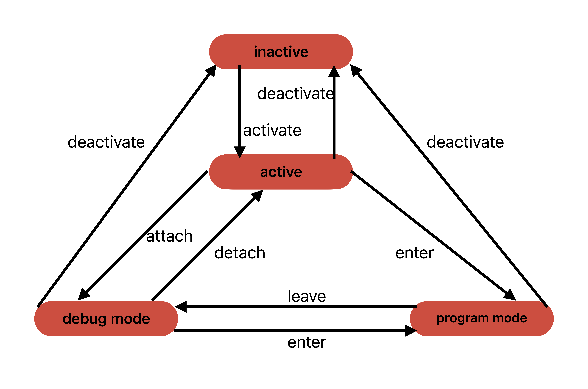

### Test of attaching to a JTAG target OCD

Download, create a virtual Python environment, and install requirements (in requirements.txt) with pip. Then start 

- test.py: Works flawlessly with Atmel-ICE. SNAP breaks already at the first read_sram (line 186).
- test1.py: This contains the 'restart' method and 'demonstrates' that entering debug mode with enter_progmode/leave_progmode is a safe solution. If you comment out the lines 212/213, then SNAP and Atmel-ICE both throw an exception. 

In general, test.py and similar programs work perfectly for ATmega164PA (and other Megas) on Atmel-ICE, JTAGICE3, Power debugger, and EDBG (on ATmega324BP Xplained Pro), but have problems on SNAP and PICkit4. Apparently, for the latter two, the debugger state machine does not work as described in Section 7.5 of *Embedded Debugger-Based Tools Protocols User's Guide*. After reading this section, I pictured the state machine as follows.

And this seems to be what is implemented in Atmel-ICE, JTAG-ICE, and others (but see test1.py). One might be able to draw another FSM for SNAP and PICkit4, but it would definitely be less regular. In any case, the only safe way to switch between programming mode and debugging mode is to force a restart of the session by using `deactivate_physical` followed by `activate_physical`. Further, since the `attach` call often also leads to problems, i.e., one does not end up in debugging mode, one should enter debug mode using `enter_progmode` followed by `leave_progmode`.

